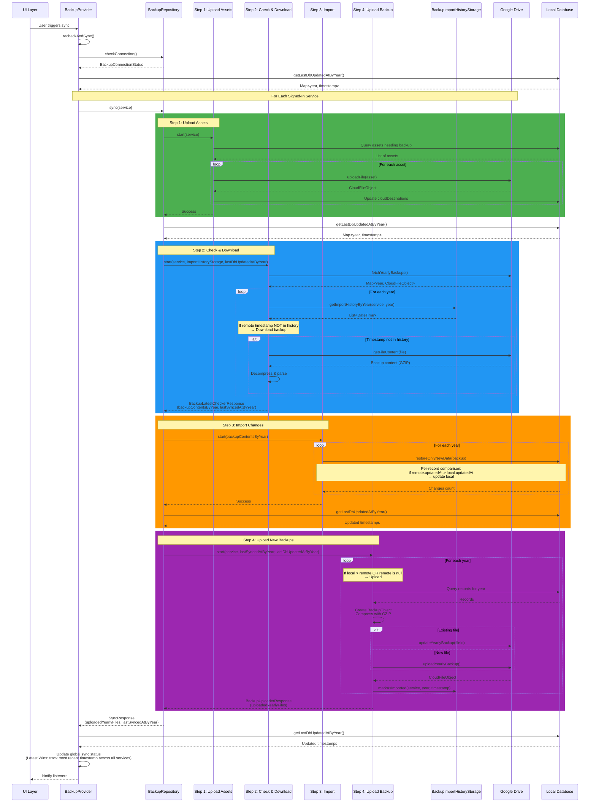

# Backup System

Multi-device cloud backup and sync for StoryPad using Google Drive with timestamp-based conflict resolution.

## Architecture



## New Device Protection

The system prevents new devices from overwriting cloud data by tracking imported backup timestamps, NOT by comparing local vs remote timestamps:

**Why timestamp comparison fails:**

- New device writes data before signing in (local: 3:00 PM)
- Cloud has old backup from another device (remote: 12:00 PM)
- If we check `local > remote`, Step 2 won't download the backup
- Step 4 would upload local data, overwriting the cloud backup → **data loss** ❌

**How it actually works:**

1. Step 2 checks if remote backup timestamp exists in `BackupImportHistoryStorage`
2. If timestamp NOT in history → Download the backup (regardless of local timestamp)
3. Step 3 imports: compares per-record timestamps, keeps newer records
4. Step 4 uploads only if local is newer than remote
5. After upload, timestamp is marked in import history

**Example:**

- New device writes local data (local: 3:00 PM)
- Cloud has backup (remote: 12:00 PM)
- Import history is empty (new device never uploaded)
- Step 2 downloads 12:00 PM backup because timestamp NOT in history
- Step 3 compares per-record: keeps 3:00 PM records (newer)
- Step 4 uploads merged data with 3:00 PM timestamp
- Marks 3:00 PM in import history

This approach ensures all cloud data is downloaded before any upload, protecting against accidental overwrites.

## Conflict Resolution

- **Newer Wins**: `remote.updatedAt > local.updatedAt` → update local
- **Insert Only**: New records always inserted
- **No Deletion Sync**: Deletions don't propagate across devices
- **Latest Wins Strategy**: Global sync status tracks most recent timestamp across all services

## File Format

**Filename**: `Backup::3::{year}::{timestamp}::{device_model}::{device_id}.zip`

**Structure**: GZIP-compressed JSON with yearly partitioning

```
appDataFolder/
  ├── images/                    ← Image assets
  ├── audio/                     ← Audio assets
  ├── backups/                   ← v3 yearly backups folder
  │   ├── Backup::3::2025::1734350000000::iPhone 15 Pro::ABC123.zip
  │   ├── Backup::3::2024::1704067200000::iPad Pro::DEF456.zip
  │   └── Backup::3::2023::1672531200000::iPhone 15 Pro::ABC123.zip
  │
  └── Legacy backups (v2/v1) in root (fallback for new devices)
      ├── Backup::2::1704067200000::iPhone 15 Pro::ABC123.zip
      ├── story2025-01-20 21:31:05.234761.zip
      └── Backup::v1::1672531200000::iPhone 15 Pro.json
```

### Fallback Strategy for New Devices

When a new device signs in and has no v3 backups yet:

1. `fetchYearlyBackups()` first tries to fetch v3 backups from `backups/` folder
2. If v3 backups are empty, it seamlessly falls back to legacy v2/v1 backups from root folder
3. Legacy backups are stored with a **sentinel year (-1)** to mark them as non-yearly backups
   - This prevents accidental misuse if code tries to interpret them as real yearly backups
   - Year -1 is the standard sentinel value and will fail validation if used incorrectly
4. Only the most recent legacy backup is fetched (monolithic backup contains all years)
5. Once v3 backups are created, they take precedence in future syncs

**Filename Format**: `Backup::3::{year}::{timestamp}::{device_model}::{device_id}.zip`

**Example**: `Backup::3::2025::1734350000000::iPhone 15 Pro::ABC123.zip`

```json
{
  "version": 1,
  "year": 2025,
  "meta_data": {
    "created_at": "2025-11-15T10:30:00.000Z",
    "device_model": "iPhone 15 Pro",
    "device_id": "ABC123DEF456"
  },
  "tables": {
    "stories": [
      {
        "id": "...",
        "title": "...",
        "createdAt": "2025-...",
        "updatedAt": "..."
      }
    ],
    "tags": [
      /* only records created in 2025 */
    ],
    "events": [
      /* only records created in 2025 */
    ],
    "templates": [
      /* only records created in 2025 */
    ],
    "assets": [
      /* only records created in 2025 */
    ],
    "preferences": [
      /* only records created in 2025 */
    ],
    "relax_sound_mixes": [
      /* only records created in 2025 */
    ]
  }
}
```

**Key Changes**:

- **Per-Year Files**: Separate backup file for each year (2025, 2024, 2023, etc.)
- **Smart Sync**: Only upload/download years with changes since last sync
- **Smaller Files**: Each file contains only one year's data (~2-3 MB vs 15+ MB)
- **Year in Filename**: Year is explicitly part of the filename for easy identification

**Benefits**:

- ⚡ **3-5x Faster**: Sync only changed years instead of entire history
- 💾 **Smaller Files**: Individual yearly files much smaller than monolithic backup
- 🔄 **Better Scalability**: Performance doesn't degrade with years of usage
- 📊 **Easier Management**: View/restore specific years independently

### Legacy Format (v1/v2)

**Note**: Contains ALL records from ALL years in single file. No longer created by current app versions.

- **v2**: `Backup::2::{timestamp}::{device_model}::{device_id}` (GZIP compressed)
- **v1**: `Backup::v1::{timestamp}::{device_model}.json` (uncompressed JSON)

## Related Classes & Files

```
lib/
├── core/
│   ├── repositories/
│   │   └── backup_repository.dart
│   │       ├── SyncResponse class
│   │       ├── sync(service) method
│   │       ├── startStep1/2/3/4 methods
│   │       └── getLastDbUpdatedAtByYear() method
│   │
│   ├── services/
│   │   └── backups/
│   │       ├── backup_cloud_service.dart (abstract)
│   │       ├── google_drive_cloud_service.dart
│   │       ├── backup_service_type.dart
│   │       │
│   │       └── sync_steps/
│   │           ├── backup_images_uploader_service.dart (Step 1)
│   │           ├── backup_latest_checker_service.dart (Step 2)
│   │           ├── backup_importer_service.dart (Step 3)
│   │           ├── backup_uploader_service.dart (Step 4)
│   │           ├── backup_sync_message.dart
│   │           │
│   │           └── utils/
│   │               ├── restore_backup_service.dart
│   │               ├── backup_databases_to_backup_object_service.dart
│   │               └── json_tables_to_model_service.dart
│   │
│   ├── storages/
│   │   └── backup_import_history_storage.dart
│   │       ├── getImportHistoryByYear() method
│   │       ├── markAsImported() method
│   │       └── clearService() method
│   │
│   ├── objects/
│   │   ├── backup_object.dart
│   │   ├── cloud_file_object.dart
│   │   ├── google_user_object.dart
│   │   │
│   │   └── backup_exceptions/
│   │       ├── backup_exception.dart
│   │       ├── backup_error.dart
│   │       └── backup_error_type.dart
│   │
│   ├── types/
│   │   ├── backup_result.dart (sealed)
│   │   │   ├── BackupSuccess<T>
│   │   │   ├── BackupFailure<T>
│   │   │   └── BackupPartialSuccess<T>
│   │   ├── backup_connection_status.dart
│   │   └── backup_error.dart
│   │
│   └── databases/
│       ├── models/
│       │   ├── story_db_model.dart
│       │   ├── tag_db_model.dart
│       │   ├── event_db_model.dart
│       │   ├── template_db_model.dart
│       │   ├── asset_db_model.dart
│       │   ├── preference_db_model.dart
│       │   └── relex_sound_mix_model.dart
│       │
│       └── adapters/
│           └── base_db_adapter.dart
│
└── providers/
    └── backup_provider.dart
        ├── recheckAndSync() method
        ├── signIn() method
        ├── signOut() method
        ├── requestScope() method
        ├── _syncBackupAcrossDevices() method
        └── Properties: syncing, lastSyncedAtByYear, lastDbUpdatedAtByYear
```

**Key Classes:**

- **BackupRepository** - Orchestrates 4-step sync per service
- **BackupProvider** - State management and UI orchestration
- **BackupImportHistoryStorage** - Tracks imported/uploaded timestamps
- **Step 1-4 Services** - Individual sync step implementations
- **BackupResult<T>** - Type-safe error handling (sealed class)
- **SyncResponse** - Carries uploaded files and remote timestamps
- **RestoreBackupService** - Handles selective/force restore operations
