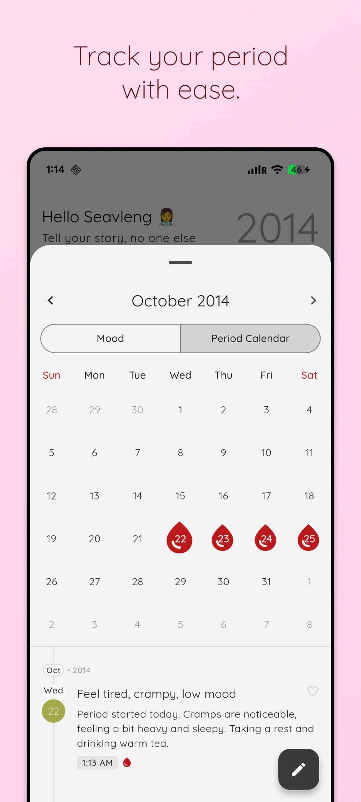
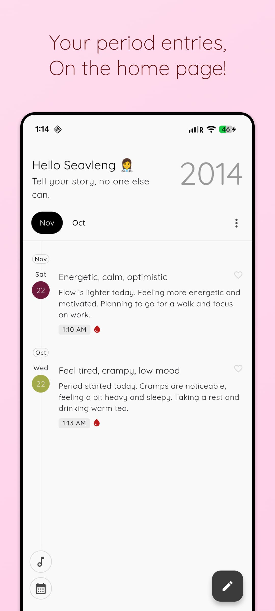
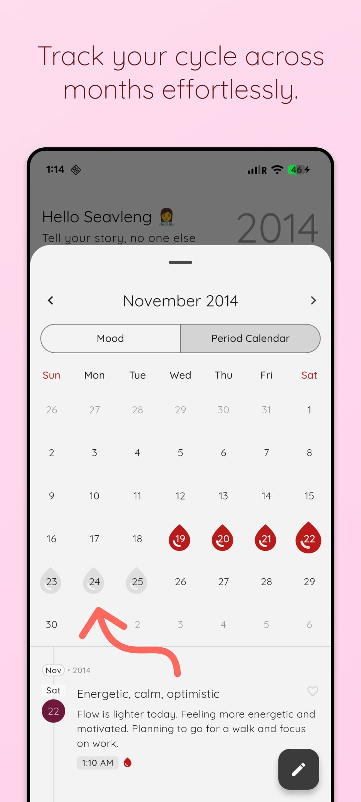

# Period Calendar Add-on

**Price:** $1.99 (one-time purchase, lifetime access)

## Description

Track your period cycle with ease, right inside your StoryPad journal. The Period Calendar add-on gives you a beautiful, intuitive way to monitor your cycle while keeping all your personal notes in one place. It's more than just a tracker—it's a seamless part of your journaling experience.

## Why You'll Love It

- **All-in-One Tracking**: See your period entries right on your home page
- **Effortless Monitoring**: Track your cycle across months with a clean, intuitive interface
- **Private & Secure**: Your data stays on your device
- **Beautiful UI**: Enjoy a calendar that's both functional and visually appealing

## Screenshots

|                                                                                                  |                                                                                                  |                                                                                                  |
| :----------------------------------------------------------------------------------------------: | :----------------------------------------------------------------------------------------------: | :----------------------------------------------------------------------------------------------: |
|  |  |  |

## Features

### Calendar View

- **Visual Tracking:** See your period days at a glance
- **Month Navigation:** Easily move between months
- **Event Indicators:** Clear visual indicators for period days
- **Dark/Light Theme Support:** Automatically adapts to your app theme

### Period Management

- **Quick Logging:** Mark period days with a single tap
- **History:** View your past cycle history
- **Private & Secure:** Your data stays on your device
- **Export:** Export your cycle data if needed

### Integration with Stories

- **Quick Entry:** Create a new story entry for any day with a single tap
- **Tagging:** Automatically tag period-related entries
- **Search:** Easily find all period-related stories

## How to Use

1. **Track Your Period**: Simply tap on a date to mark your period days
2. **View at a Glance**: See your cycle history across months with color-coded indicators
3. **Quick Access**: Your period entries appear on the home page for easy reference
4. **Add Notes**: Tap any day to add journal entries about your cycle
5. **Navigate Easily**: Swipe between months or use the navigation controls

## Privacy

Your period data is stored locally on your device and securely backed up to your Google Drive, accessible only by you. All data is encrypted and protected by your device's security settings and Google's security measures. No one else can access your data unless they have access to your Google account.

## Technical Notes

- Uses `EventDbModel.db` for storing period data
- Integrates with the existing calendar UI components
- Follows the app's theming system for consistent appearance
- Available as a one-time in-app purchase

## Support

If you have any questions or issues with the Period Calendar add-on, please contact our support team through the app's settings menu.
