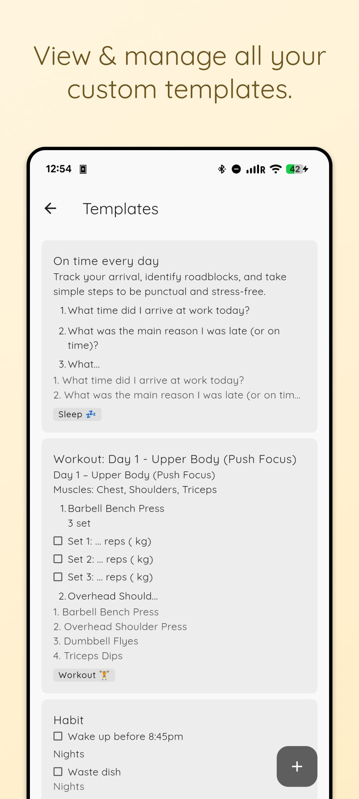
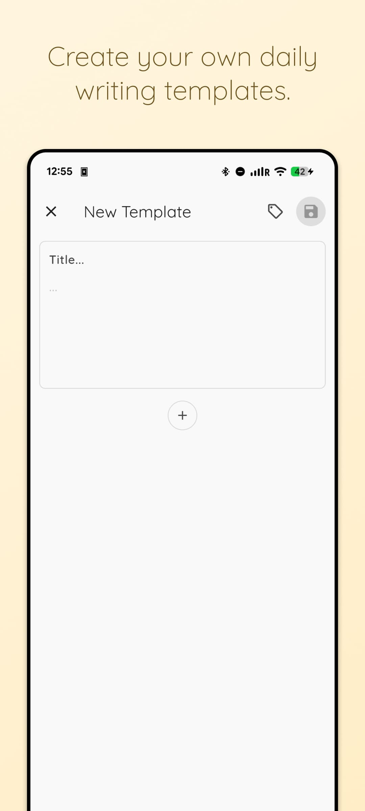
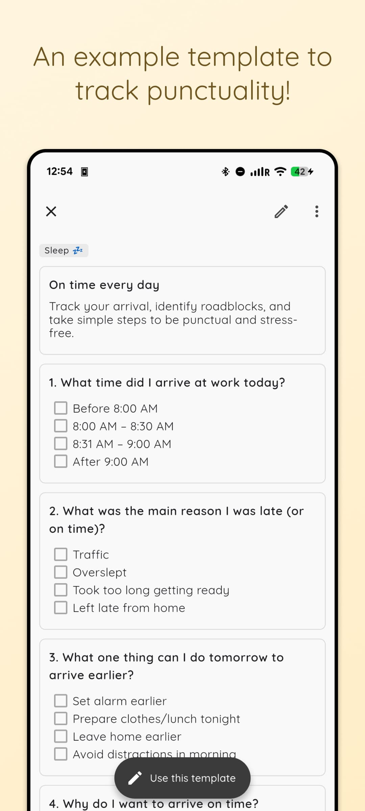
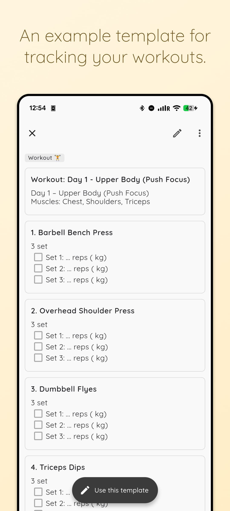

# Templates Add-on

**Price:** $1.99 (one-time purchase)

## Description

Create your own daily writing templates. The Templates add-on allows you to design reusable writing structures that help you maintain consistency and establish productive writing habits.

## Screenshots

|                                                                                     |                                                                                     |                                                                                     |                                                                                     |
| :---------------------------------------------------------------------------------: | :---------------------------------------------------------------------------------: | :---------------------------------------------------------------------------------: | :---------------------------------------------------------------------------------: |
|  |  |  |  |

## Features

### Template Gallery

- **Browse Categories:** Explore pre-built template collections organized by purpose
- **Template Preview:** View full template content before saving or using
- **Save as Custom:** Save gallery templates as your own custom templates for editing
- **Instant Use:** Apply gallery templates directly to create new stories

### Template Creation

- **Custom Content:** Design your template with any text, formatting, or structure
- **Rich Text Support:** Use all story editor features (markdown, formatting, etc.)
- **Tag Support:** Organize templates with tags
- **Preferences:** Each template can have its own visual preferences

### Template Management

- **Create:** Design new templates from scratch
- **Edit:** Modify existing templates anytime
- **Archive:** Archive templates you're not currently using
- **Reorder:** Drag and drop to organize your template list
- **Delete:** Remove templates you no longer need

### Template Usage

- **Quick Access:** View all templates in one place
- **Preview:** See template content before using
- **Apply:** Use a template to create a new story with pre-filled content
- **Date Context:** Templates can be applied to specific dates

## Use Cases

### Daily Journaling

Create a template with prompts like:

- What am I grateful for today?
- What did I accomplish?
- What challenges did I face?
- What's my plan for tomorrow?

### Writing Practice

Structure your practice sessions:

- Warm-up exercise
- Main writing prompt
- Reflection section

### Goal Tracking

Monitor progress consistently:

- Today's goals
- Progress update
- Obstacles encountered
- Next steps

### Creative Writing

Maintain story structure:

- Scene setting
- Character development
- Plot points
- Dialogue notes

## Technical Implementation

### Core Files

```
lib/
├── core/
│   ├── objects/
│   │   ├── gallery_template_object.dart
│   │   ├── gallery_template_category_object.dart
│   │   └── gallery_template_page_object.dart
│   ├── services/
│   │   └── gallery_template_service.dart
│   └── databases/
│       └── models/
│           ├── template_db_model.dart
│           ├── story_content_db_model.dart
│           └── story_preferences_db_model.dart
└── views/
    └── templates/
        ├── templates_view.dart
        ├── templates_view_model.dart
        ├── templates_content.dart
        ├── gallery/
        │   └── show/
        │       ├── show_template_gallery_view.dart
        │       ├── show_template_gallery_view_model.dart
        │       └── show_template_gallery_content.dart
        ├── edit/
        │   ├── edit_template_view.dart
        │   └── edit_template_view_model.dart
        ├── show/
        │   ├── show_template_view.dart
        │   └── show_template_view_model.dart
        └── local_widgets/
            ├── template_tile.dart
            ├── template_tag_labels.dart
            ├── gallery_tab.dart
            ├── gallery_template_card.dart
            └── empty_body.dart
```

### Key Components

**TemplatesViewModel** (`lib/views/templates/templates_view_model.dart`)

- Loads templates from database
- Handles navigation to create/edit/show views
- Manages template reordering
- Filters archived vs active templates

**TemplateDbModel** (`lib/core/databases/models/template_db_model.dart`)

- Core template data structure
- Properties:
  - `id`: Unique identifier
  - `index`: Sort order
  - `tags`: Associated tag IDs
  - `content`: Template content (StoryContentDbModel)
  - `preferences`: Visual preferences (StoryPreferencesDbModel)
  - `createdAt`, `updatedAt`: Timestamps
  - `archivedAt`: Archive status
  - `lastSavedDeviceId`: Sync tracking
  - `storiesCount`: Usage tracking

### Gallery Template Structure

**GalleryTemplateObject** (`lib/core/objects/gallery_template_object.dart`)

- Pre-built template data loaded from YAML files
- Properties:
  - `id`: Unique identifier
  - `name`: Display name
  - `purpose`: Brief description
  - `note`: Optional usage note
  - `pages`: List of template pages
  - `iconUrlPath`: Icon asset path

**GalleryTemplateCategoryObject** (`lib/core/objects/gallery_template_category_object.dart`)

- Groups related gallery templates
- Properties:
  - `name`: Category name
  - `description`: Category description
  - `templates`: List of templates in this category

**GalleryTemplateService** (`lib/core/services/gallery_template_service.dart`)

- Loads gallery templates from bundled YAML assets
- Organizes templates by category
- Supports localization (EN-only currently)

### Database

**Storage:** ObjectBox local database

- Adapter: `TemplatesBox` (`lib/core/databases/adapters/objectbox/templates_box.dart`)
- Supports filtering by archived status
- Maintains sort order via `index` field

### Template Structure

Templates reuse the same content and preferences models as stories:

**StoryContentDbModel**

- Stores the actual template text and formatting
- Same structure as regular story content

**StoryPreferencesDbModel**

- Visual settings (font, colors, etc.)
- Applied when creating stories from template

### Gallery Assets

Gallery templates are stored as YAML files:

- Path: `/templates/`
- Files: `1_daily_reflection.yaml`, `2_reflection_and_gratitude.yaml`, etc.
- Structure: Categories containing multiple template examples
- Icons: Referenced from `/icons/hand_drawn/` directory

### Demo Assets

Template screenshots for the add-on showcase:

- Path: `/add_ons_demos/templates/`
- Files: `template_1.jpg`, `template_2.jpg`, `template_3.jpg`, `template_4.jpg`, `template_5.jpg`

### Translations

UI text is localized:

- Add-on metadata: `add_ons.templates.title`, `add_ons.templates.subtitle`
- Page title: `page.templates.title`
- Empty state: `page.templates.empty_message`
- Buttons: `button.new_template`, `button.use_template`

## User Flow

### Browsing Gallery Templates

1. Navigate to Add-ons → Templates
2. Switch to "Gallery" tab
3. Browse template categories (Daily Reflection, Creative Writing, etc.)
4. Tap any template card to preview full content
5. Choose to "Use Template" or "Save as Custom Template"

### Creating a Template

1. Navigate to Add-ons → Templates
2. Switch to "My Templates" tab
3. Tap "New Template" button
4. Design your template content
5. Add tags (optional)
6. Set preferences (optional)
7. Save the template

### Using a Template

1. Browse your template library or gallery
2. Tap on a template to preview
3. Tap "Use this template"
4. Template content is copied to a new story
5. Edit and customize as needed
6. Save as a regular story

### Managing Templates

1. **Reorder:** Long-press and drag templates
2. **Edit:** Tap template → Edit
3. **Archive:** Move unused templates to archives
4. **View Archives:** Access archived templates separately
5. **Delete:** Permanently remove templates

## Analytics & Usage Tracking

### Template Usage Recording

When users click "Use Template" (either from gallery or custom templates), the app records usage to Firestore:

**Service:** `GalleryTemplateUsageService` (`lib/core/services/gallery_template_usage_service.dart`)

- Tracks template usage per device
- Records to: `templates/{templateId}/devices/{deviceId}`
- Deduplicates calls to avoid excessive Firestore writes

**Data Recorded:**

```
Device Usage Document:
├── device_id: string (device identifier)
├── last_used_at: timestamp (server time)
├── usage_count: integer (incremented on each use)
├── first_used_at: timestamp (server time)
└── model: string (device model)
```

**Flow:**

1. User clicks "Use Template"
2. `AnalyticsService.logUseGalleryTemplate()` logs event to Firebase Analytics
3. `GalleryTemplateUsageService.recordTemplateUsage()` records to Firestore
4. If device entry exists: increment `usage_count` and update `last_used_at`
5. If device entry doesn't exist: create new entry with `usage_count: 1`

**Gallery Template Setup & Usage Sync:**

The `populateGalleryTemplateStats` script manages template documents and aggregates usage:

- **Script:** `bin/populate_gallery_template_stats`
- **Implementation:** `bin/firebase_admin/populate_gallery_template_stats.js`
- **Purpose:**
  - Creates template documents from YAML files
  - Fetches all device usage records
  - Calculates total usage count per template
  - Stores aggregated `total_usage` on template documents
- **Fields Updated:**
  - `total_usage`: Sum of all device usage counts (integer)
  - `last_usage_sync_at`: Timestamp of last aggregation (server time)
- **Run:** Execute after adding new gallery templates or periodically to sync usage statistics

### Analytics Events

**Event:** `use_gallery_template`

- Parameter `template_id`: ID of the template used
- Parameter `source`: Origin of the use (`gallery` or `my_templates`)

Example from `ShowTemplateGalleryViewModel`:

```dart
AnalyticsService.instance.logUseGalleryTemplate(
  templateId: galleryTemplate.id,
  source: 'gallery',
);
```

Example from `ShowTemplateViewModel`:

```dart
AnalyticsService.instance.logUseGalleryTemplate(
  templateId: template.id.toString(),
  source: 'my_templates',
);
```

## Purchase Verification

The add-on checks purchase status via:

- `InAppPurchaseProvider.template` getter
- Product identifier: `AppProduct.templates`
- Supports both purchased and reward-unlocked access

## Integration with Stories

When a template is used:

1. Template content is copied to a new story
2. Template preferences are applied
3. Template tags can be inherited
4. Story is created with current date (or specified date)
5. Original template remains unchanged
6. **Usage is recorded to Firestore** (via `GalleryTemplateUsageService`)
7. Analytics event is logged (via `AnalyticsService`)
